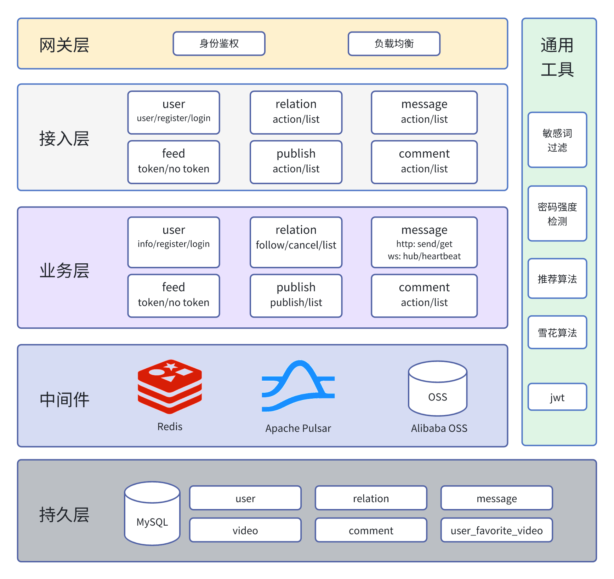
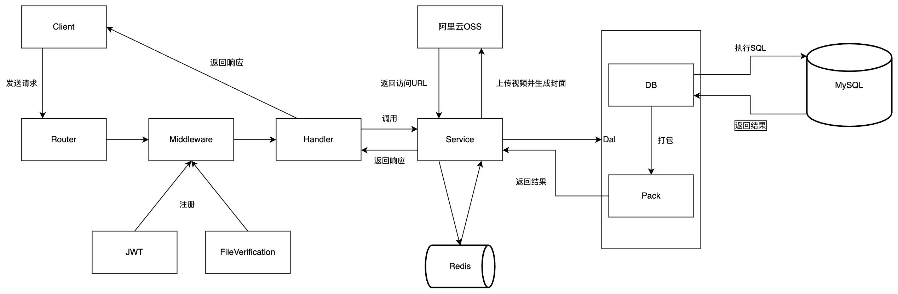
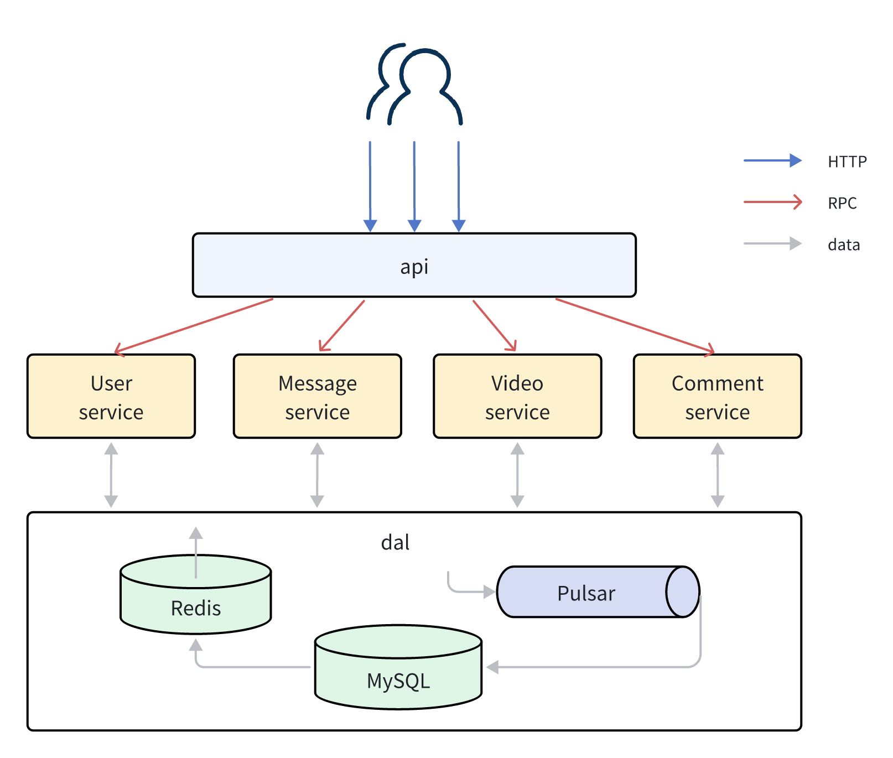

# StandAloneTikTok
Used Hertz, GORM, MySQL, Redis, Pulsar, WebSocket, Docker and other technology stacks to implement all the functional modules interface jitter. Add access to the recommendation algorithm.

The project function is realized completely, and compatibility correction is made for some interfaces, and other better solutions are given, and the integration test and some performance tests are completed.

The overall safety and reliability of the project is high: password encrypted storage, password complexity constraints, upload file type checking and other ways to ensure security, access to Pulsar as a message queue to improve the availability of write requests, use Redis as a cache to provide the availability of the read data requests, the use of transactions, Lua scripts and other ways to ensure data consistency.

More performance optimization: the database is set up with appropriate and necessary indexes, SQL is optimized, and Redis is introduced to preload Lua scripts, batch processing and other optimization methods to optimize performance.

Reason for **not using the microservice** for priority development: Hardware reasons, the standalone architecture version has better performance and higher development efficiency under the current existing hardware conditions.

(This intro was translated by DeepL, and credit goes to the original author [@DawnSiro](https://github.com/DawnSiro))

## Architecture

